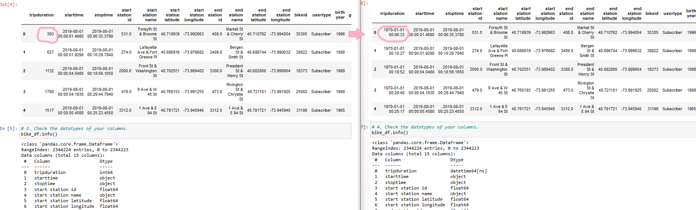
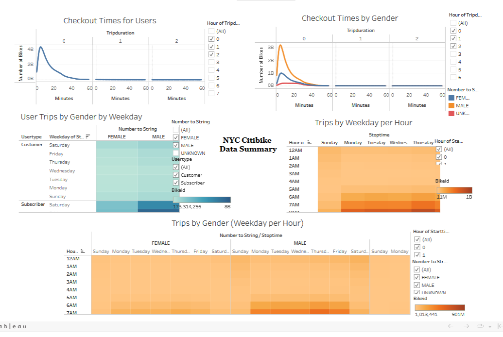

# bikesharing
# Overview of Project
Tableau is a popular tool to use when providing data visualization.  It is considered to be easy to use and understand. For this module, Tableau Public, python, jupyter notebook, and pandas were used.  Tableau uses sheets and dashboards to create stories.  A story was created for this project and can be found at the following link.

## NYC City Bike Analysis Story Link
[link to dashboard](https://public.tableau.com/app/profile/ludivina.lemay "link to dashboard")

## *Purpose*
The purpose of this project was to use Tableau to create visualizations for a Citi Bike program.

# Results
Data from the Citi Bike program in New York City was used for this project.  More specifically, data from August 2019 was analyzed.

To analyze the data, the "tripduration" column in the data was first converted to a datetime datatype as seen in Figure 1.

## *Figure1*

Later, the data was imported to Tableau and vrious visualizations were made for checkout times for users, checkout times by gender, trips by weekday per hour, trips by gender(weekday per hour), and user trips by gender by weekday. Figure 2 shows a quick view of all the visualizations combined.  However, the link included above shows the interactive storybook. 

## *Figure 2*

Some key findings for this project were the following.
1. About 81% of Citi bike users are Subscribers
2. Males and Females tend to have a slightly different time trips.
3. Some start and end stations are more popular than others.  It maybe because they are by the waterfront. 

# Summary
Overall, Tableau is considered to be easy to use.  Make sure to keep track of the measures and dimensions.  Dimension values are qualitative while measures are quantitative. 
